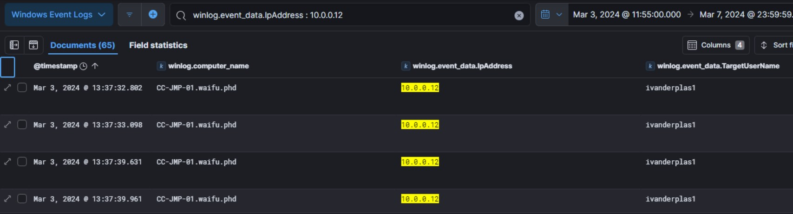

# Xintra's Waifu University Lab Walkthrough

Writing up a walkthrough to figuring out the incident at XINTRA's Waifu University.   This lab is an emulation of Alphv/BlackCat ransomware group.

### Section 1: Understanding the network
From a bird's eye view, the network at Waifu follows a standardised design. Anyone, from the university who has access to the domain, should be able to connect to the production network, once authenticated in the DMZ part of the network. 

Let's take it step-by-step, assuming one's trying to connect into the production network.

#### 1a. Internet to DMZ
First, anyone from the internet has to enter the network first. The DMZ is a buffer between the CC-VNET and the internet.  

External users first attempt to connect to CC-VPN-01 (20.211.102.12) via the protocols shown (HTTPS, OpenVPN, SSH). CC-VPN-01 is configured to use SAML authentication, meaning it may not store passwords locally. Instead, it will redirect the user to an external Identity Provider (like MS Entra, used here). The user will then enter their password and MFA, and when verified, a SAML Assertion token is sent back to CC-VPN-01 confirming the user's identity. 

After the credentials are validated, the user establishes a VPN session into the DMZ (10.0.0.0/24). 

#### 1b. DMZ to Production Network
The other component in the DMZ is the Virtual Desktop Gateway (CC-VDG-01). The VDG assumes that a trusted VPN session is spun up with verified the user's MS Entra identity, and they can log in to a remote desktop environment.  But not all users will have the same access to the Waifu domain's resources. At VDG, the user's Waifu domain credentials get verified to provide the right amount of access. 

For that, Active Directory authentication is used. It's to make sure that a user has the correct set of permissions to access resources they may need from the internal systems based on Waifu's policies and role-based access controls. 

From CC-VDG-01, users connect via RDP to the Jumpbox, CC-JMP-01. The Jumpbox acts as a gateway to the production network. Only RDP is used between the Jumpbox and the production network's servers.  Here's one explainer video [why that's the case](https://www.youtube.com/watch?v=9FN31QDLyFs).  

CC-VDG-01 forwards authentication request to the Domain Controller (CC-DC-01). The DC verifies credentials and applies the respective access to the user. 

CC-ELK-01, is the server where all login attempts, VPN Connections and failed authentications will get logged and monitored. 

### Section 2: Solving the Lab

#### Section 2a. Scoping the Incident
After gaining an understanding about the layout of Waifu's network, the next goal was to kickstart the VM and solve the lab. After an initial read-through of the CTI reports this was built on, and the devices' purposes from above, the first device's triage to inspect was CC-DC-01's. Amongst the devices traversed through so far, it had the highest likelihood of valuable data to encrypt. 

As there's a good chance various Waifu university individuals would need to access resources from CC-DC-01, any ransom note might need to be deployed to a user with a high level of access. Amongst them in the Users Folder of the CC-DC-01 triage, there's a potential file of the ransom note seen in its downloads. 

Upon opening and reading the ransom note, there's more details about the encryption type and domain the victim has to visit for further communications with the group. 

And that concludes the first portion of the lab, Scoping the Incident. 

#### Section 2b. Initial Access via Entra ID
Now, it's been understood that in order for a ransomware group to come this far; into CC-DC-01 to encrypt files and drop a ransomnote, then some user account with this much access had been used. To inspect what possible Waifu domain accounts were utilised, the next step is to investigate all the logs captured before the triage acquisition date. This will involve looking into the ELK instance, and the respective logs. 

With respect to the diagram, we'd first need to see which Entra ID account was used. Based on the Elastic website, it is shown that Entra ID logs are part of [Azure logs integration](https://www.elastic.co/guide/en/integrations/current/azure-adlogs.html). Therefore, the first thing to do is to ensure our ELK instance is set to inspecting the Azure logs as shown below. 

Once this is done, we can proceed with the details we need to find for how Initial Access was executed. Amongst the logs, there are distinct groups of logs: auditlogs, activitylogs, signinlogs, amongst others. The first hint from the question is that there were failed logon attempts to the Identity Provider (Entra ID). This might mean, while the identity credentials were correct, MFA might've kept blocking the attacker from entering. To narrow down the log type to use for this, we can start with the azure.activitylogs.{subsection logs}. 

To start, some of the subsections included were identity_name, operation_name, resultDescription, result_type and event_category. 

After that, it was useful to OSINT what kind of error values or codes that can come from an unsuccessful logon attempt in EntraID. This [website](https://learn.microsoft.com/en-us/entra/identity-platform/reference-error-codes#aadsts-error-codes:~:text=a%20temporary%20condition.-,AADSTS%20error%20codes,-Expand%20table), gave some values. After inspecting in the ELK instance, the logs that matched these possible errors was the "azure.activitylogs.result_type" field. 

After removing out the "0"-valued logs, the rest of the values for that log, began with "5". Amongst the remaining values, the very intriguing ones included:

i. 50074 - UserStrongAuthClientAuthNRequiredInterrupt - Strong authentication is required and the user did not pass the MFA challenge.  

ii. 50126 - InvalidUserNameOrPassword - Error validating credentials due to invalid username or password. The user didn't enter the right credentials. Expect to see some number of these errors in your logs due to users making mistakes.

These two codes looked promising as a start, and with these has a clue, the first filter was designed to narrow down the logs to the suspicious failed logon activities. 

Thankfully, logs have been significantly reduced. Within the fields, I opted to narrow my values down even further, by removing some names extra names that were out of context of the attack. At this point, it was good to revisit the descriptions of the two error codes from above.   

A failed logon meant that the entered username:password pairs were invalid in the first place. The attacker hadn't gone past that part to require authentication of the MFA challenge. 

Therefore, from that original filter designed above, the focus turned to only azure.activitylogs.result_type = 50126.

Mapped with the timeline, the biggest flurry of failed logons happened in Mar 3rd. Resetting the calendar icon to Mar 3, 2024, 0000 Hours, we have 30 "50126" logs to decipher what we need to know about the Initial Access. 

Opening one of these logs fully: we can acquire the user agent string from its "azure.activitylogs.properties" JSON.  

With this modified timeframe, under field statistics, it is also possible to get the total number of unique users that were used for the attempted logons.  

So, from here, it felt like a good idea to now modify the "azure.activitylogs.result_type = 50126" filter to also be OR 50074. After the failed logons, the ransom note present shows that there was one successful logon, else, it wouldn't have been planted there.   

From there, we might need to inspect the logs whereby after a long series of 50126 logs, a 50074 one lands. 

When seen graphically, there's a lot of activity before noon on Mar 3rd. So scrolling through the logs of that 11th hour, a 50074 log happens at 11:58am of that day, after a lot of 50126 logs. Amongst these 50126 logs, we can see the IP range of addresses were quite close. 

But when inspecting the 50074 log, the IP address is not in the proxy IP range anymore. (Did the attack stop using a Proxy Server?) 

From there, we can extract the identity, email and IP address that successful login came from. And from that IP address, it's possible to find its SSH fingerprint on Shodan. 

And that will conclude the second portion of the lab: Initial Access. 

#### Section 2c. Breaching the University. 

From here: we've understood the user account used to enter the Waifu university network (ivanderplas1@waifu.phd), and the successful login happened at 11:58am of Mar 3rd 2024. Hence, using this identity, it's likely the actor would've continued into the network. CC-VDG-01, into the Jumpbox, and into CC-DC-01 afterwards. 

Given that VDG emulates what happens at CC-VPN-01, the next best thing is to see if any "entry" happened there next. 

As per our network diagram above, the IP address of VDG is 10.0.0.12. 
With the previous time of incident narrowed down, to 11:58am, Mar 3rd 2024, entry into the Jumpbox would've had to take place after that. 

As we're dealing with the network logs now, and the network photo indicates that the Jumpbox is a Windows machine, the logs to look at now, is the Windows Event Logs.

When filtering the logs to just "winlog.event_data.IpAddress" being of value 10.0.0.12, the logs get narrowed down sufficiently, we can see activity associated to the jumpbox begins at 1:37pm of Mar 3rd, 2024. Some columns added in ELK's view were winlog.computer_name, winlog.event_data.IpAddress, winlog.event_data.TargetUserName. 

Most of the logs registered from that point in time onwards, overlap amongst these 3 values (cc-jmp-01, 10.0.0.12, ivanderplas1). Inspecting the first log from 1:37:32pm, Mar 3rd, 2024, there are some other fields that can be suitable for this section. 

Amongst the fields, the winlog.event_data.WorkstationName is a plausible value for the threat actor's device. 

So, chances are, at the Jumpbox, there would've been some activity. To have a look-see at what might've happened there, the next thing to do is to have a look at CC-JMP-01's triage. As its a Windows Machine, to see if there were any sites the threat actor visited as the user ivanderplas1, it made sense to look into the "C:/Users/ivanderplas1" branch. 

For browser history, looking into "AppData/Local/Microsoft" gives these folders to investigate:

Amongst these, Edge was the most populated folder, and subsequently, a History folder was also found. Opening the history file with the "DB Browser for SQLite" tool, and amongst the SQL tables, the "urls" and "visited_links" tables showed what the threat actor had been looking up. 

At the same time, along with XINTRA's questions, it's also made known that the attacker had done some work with PowerShell. The related data to Powershell is typically part of "AppData/Roaming/Microsoft/Windows"

Opening the PowerShell file, we can extract out the respective domain and subdomains visited by the threat actor. 

And that concludes the third portion of the lab: Breaching the University.

#### Section 2d. Privilege Escalation
Moving forward, it took some time to gather all the details we have so far. 
We've narrowed down the user as being "ivanderplas1". In order to ensure those logs of that username is added, one extra column included was "winlog.event_data.User" in the ELK stack for Windows Log events. 

Next, the previous part has shown us that the command line was used in the triage of CC-JMP-01. That value, would've been registered under "winlog.event_data.CommandLine". 

For good measure, those two columns are added into the table, to navigate this privilege escalation better. 

Now with these filtered activity, the next was to see when our github activity on the command line was executed. And we can find that, thereabouts at 1700 Hours on March 3rd. 

Cutting these logs off at this point in time, we can now look at a narrower set to see what else is done. 

After this point, at around 1753 Hours, some interesting commands can be seen. 

The entire compilation of these commands put together is:

    wmic service get name,displayname,pathname,startmode
    findstr /i "auto"
    findstr /i /v "c:\windows\\"
    findstr /i /v """

When Google Dorking this command, it is understood it's a technique called [Find Services with Unquoted paths](https://github.com/xapax/security/blob/master/docs/attacking_active_directory_domain/attacking_windows_domain_local_privilege_escalation.md#manually-2). 
Search this technique with a "mitre" at the back, its TTP code is [known](https://attack.mitre.org/techniques/T1574/009/). 

Continuing the look through the logs, there is a command line input in the next hour, along the lines of 'net stat "Waifu Service"'. What this tells us, this is trying to kick start a network service. Therefore, prior to that, an executable for this was created prior. 

And that particular binary, is found in 2 logs prior to this one:

Its path is also known. Taking e of it: C:/ProgramData/waifu.exe , the next thing to do is to calculate its SHA1 value. Navigating to this directory this is stored in, it's confirmed available as shown. 

To get its hash value, opted to utilise the tools folder that was made available in the lab environment. One route to get its value is this:

And that concludes this section of the lab: Privilege Escalation. 

#### Section 2e. Remote Access

Taking note of the "Waifu Service" net stat log, this happened at 18:16:21 of March 3rd, as "WAIFU/ivanderplas1". The next event would have had to happen after this point. Therefore, after cutting the timeline of logs from 18:15 onwards, there's a narrower set of logs to work with. 

In addition, the threat actor has escalated himself from ivanderplas1 to NT AUTHORITY/SYSTEM, as per the lab's questions. Therefore, it's after that Waifu Service log, we should try and see what services got executed as NT AUTHORITY/SYSTEM. 

Once that service/tool was found, the next thing to find was domain this tool communicated with. One neat trick I used was that, in the KQL syntax, the use of the "*", as a wildcard for part of the string. 

By entering a * at the end and beginning of the tool name, it's possible to see the instances involved around this tool.

And there is one possible solution here:

Afterwards, one interesting log is then indicated, at about Mar 4th, 2024, 1300 Hours. 

Although the command line shows a python.exe file, in its fields, we can see the tool, ScreenConnect. This shows that it's the remote tool getting renamed into something legitimate, like the executable of the programming language. Now that we know it's getting disguised as "python.exe", we should now look for other logs that contain "python.exe" in its CommandLine field, and see which values are different at which time. 

Once again, after executing the wildcard trick on "python", we can see the narrowed logs surrounding this dynamic. 

Looking at the hash values, and toggling across these 6 python logs, by the time it was the 3rd log, at Mar 5th, 23:25:24, its MD5 value was then beginning with "7059...." . 

There is one final item to find in this lab, and it is spoken about in this portion. When a remote tool is set up in the victim machine, it means its goal to make it communicate with another machine elsewhere is in the works. Typically, the indication of that happening, is in network logs. And it happens, that in the XINTRA lab, that can't be found. 

So, an alternative has been provided: a dump file of the malicious process, and with that, figure out the best way to figure out where/who the infected device is meant to communicate with. 

Amongst the tools issued (and some hints with OSINTing), the most feasible one to use was the Cobalt Strike Config Extractor and Parser. 

And that gave the result of the IP result the infected device was meant to talk to, and its respective domain. 

And with that, this section of the lab, Remote Access is completed. 

#### Section 2f. Accessing Volume Shadow Copies
This part of the lab is a bit more specific, and it's referring to Volume Shadow Copies. As per MS, anything associated with Volume Shadow copies will have "vssadmin" as part of its commands. Therefore, trying the wildcard command again, we can narrow down all the CLI executions with "vssadmin" that are part of it. 
And referring back to the previous section, "Breaching the University", the compromised host of the Waifu Uni network is CC-JMP-01. 

To bear in mind, there's a good chance one can only execute this vssadmin command when the threat actor has admin level rights, so the "User" field will also be handy to check in the logs. More about vssadmin documentation is [avail here](https://learn.microsoft.com/en-us/windows-server/administration/windows-commands/vssadmin)
With these three in mind, let's see what logs are available in ELK. 

Before a bunch of delete commands, there is one Create shadow command for the /C: executed. And it matches our beachhead host's device name as well. Expanding the ParentCommandLine field as well, there's a file that is visible that was responsible for running the "create shadow command" of the C: . 

Now, proceeding to the next part of the lab. 

#### Section 2g. Looking Around the Network
With reference to the lab, the next activity the threat actor did was open a file that was supposed to be in a hidden share from the beachhead host. There's a brief explainer of what a hidden share is [here](https://superuser.com/questions/309361/what-are-windows-hidden-shares-good-for). After a lot of OSINTing, there's a possible event code associated to this hidden network share [here](https://www.ultimatewindowssecurity.com/securitylog/encyclopedia/default.aspx). And its codes typically begin with "514", provided the OS version is Windows 10+ . 

A suggested way to narrow out the lab logs included adding the following columns below, and the starting point being the point in time the Volume Shadow copy was created. 

However, there were a lot of logs with "514*", and so, one other supporting column that is handy to include is "winlog.event_data.ShareName". A brief explainer of that can be found [here](https://docs.aws.amazon.com/fsx/latest/WindowsGuide/file-access-auditing.html). Amongst the values seen in ShareName, one interesting one was "SuperSecretSecureShare". And for a few of them, when the event.code is 5145 (meaning a network share object was checked to see whether client can be granted desired access), and any files associated with it (with the RelativeTargetName column). 

Now, we can proceed to the next part of this lab section. It requires us to find a tool the threat actor made with the beacon file discovered from Section 2e. We found out that the tool, ScreenConnect, was disguised as a "python.exe" file. 

Here's its image again from above: 

Therefore, any activity around this beacon would mean that this particular file should have been called. So, a suitable column to use for this is something that will represent this python.exe 's filepath (C:\Program Files\Python312\python.exe) as the "origin". For this, the "Image" and "CallerProcessName" fields were used. 

After scrolling through each log's fields enlarged on the side, one extra field came in handy to investigate: the winlog.task field. 

Across the logs that have our pseudo python.exe as the parent process or image, various activity has happened, as shown in the winlog.task field statistics. 

The ones into focus here will be the 'Security Group Management' ones and 'File Created'. 

In the case of the Security Group Management logs, they've been interested in the Administrator accounts, of the "Builtin" domain. 

As for the File Created log, it's called the SharpHound.exe; this was the same tool from Github that was downloaded onto the beachhead host (CC-JMP-01) in part 2c (breaching the university). 

To try and see if more things were done with this file, choosing to filter with the handy wildcard command. 
If any successful execution of SharpHound.exe had happened, a log would've been created with this as a parent process or image. 

Instead, what we see below is this: 

which is the same that we see from the beachhead host's triage's console history:

So essentially, what this shares is that, from the breached host (CC-JMP-01), the original SharpHound.exe 's github repository was reached, and it was renamed as "s.exe", due to the output flag, "-o" . And it had been executed. After which, the "dir" command would've shown the threat actor all the possible directions he could go in the Waifu network. 

However, this latest file creation log with the SharpHound.exe as a name, no new processes have begun from it. This shows that while the file was made (perhaps with a different purpose than the original SharpHound), it wasn't executed.

And that concludes this portion of the lab: Looking Around the Network

#### Section 2h. Domain Dominance
As of now, it's understood that an Administrators group was enumerated through on CC-JMP-01, at about March 6th, 02:05:13. 

Looking back at the Waifu Network image: from the Jumpbox server, the more appealing place the threat actor will hop over to is CC-DC-01. This was also the device where the ransomnote was found, and discovered some files were locked with the ".kh1ftzx" extension. 

Hence, some malicious service would've had to be installed here, and to look for that, one column I opted for was winlog.event_data.ServiceName, and as a ELK filter, ensuring it exists. 

From this, the first service installed into CC-DC-01 is 8628f7b, at 02:13:16, March 6th. 

After that, the next thing to check was the OS distribution system the threat actor would've been using. For that, the next log to check was the "WorkStationName" field, at around the timeframe of the 8628f7b log. 

And amongst the existing values, the "parrot" field is an interesting one. A mini explanation of it is found [here](https://g.co/kgs/wVNZGsn). 

Following this, it's mentioned in the lab that the threat actor then injected a DLL into one of CC-DC-01's processes. And that can be spotted with help from the following columns, like so: 

The Commandline for this log

    "C:\Users\CC-Admin\Desktop\AADInternals-master\InjectDLL.exe" 3616 "C:\PTASpy\PTASpy.dll"

is an interesting one. With a little help from ChatGPT, this breakdown helped in understanding what to look for next eventually. 

The breakdown, courtsey of ChatGPT: 

Therefore, what this shows is that Process ID 3616 in CC-DC-01 had the malicious PTASpy.dll installed within it with help from the builtin Windows toolkit. Therefore, after clearing out the filters in place so far, and adding all the fields about process IDs as columns, the next thing to do was to filter for Process 3616 in all plausible forms. 

winlog.event_data.ProcessID : 3616 (in Base 10 form)
winlog.event_data.processId : 3616 (in Base 10 form)
winlog.event_data.ProcessId : 0xe20 (in Hexa form)

Process name to ID, based on the logs so far, it's referring to processes associated with AzureADConnectAuthenticationAgentService.exe . 
With regard to finding out the credentials that were spied on and collected by PTASpy.dll, the first thing to do was to find any artifacts this "spying" might've created. For that, inspecting the processed evidence of the domain controller was the suitable technique

Amongst the files, the ones that proved to be useful were $MFT_Output and $J_Output. In the MFT_Output file, after looking up "ptaspy", it became clear this tool then created a .csv file as well. And then, specifically, narrowing that csv file down, it showed where this is located. 

However, when traversing to the path shown, to get to the .lnk file, the CSV file is not existing in the processed evidence folders. Therefore, the next best thing to do was to try and carve it. When looking up ways to do so, the LECmd tool by Zimmerman could be tried out (and it is a tool that's installed in XINTRA's workstation). 

After changing directory to where the tool exists, and executing the command, like so as advised from [Zimmerman's Github](https://github.com/EricZimmerman/LECmd):

    C:\Labs\Tools\EricZimmerman\LECmd>LECmd.exe -f "D:\C\Users\CC-Admin\AppData\Roaming\Microsoft\Windows\Recent\PTASpy.csv.lnk"

 we can see it helped carve out the CSV we want in question, and it had a file creation date at March 6th, 02:54:58. In addition, it's further confirmed by the $J_Output results. 

Hence, given the "birthday" of this PTASpy.csv, the next thing to do is to try and hunt for a Azure Log of that same timeframe, or even timestamp if it can be that accurate. So by choosing Azure Logs on the top left corner, and a timeframe of 15 mins from 02:45:00 to 03:00:00 on March 6th, we can see a potential result of another Waifu identity that was spied on by PTASpy.dll, and possibly captured into the csv file. 

And that concludes the domain dominance of this lab. 

#### Section 2i. Accessing the Good stuff
We've come awfully close to the end of the lab. Now, with initial access done, lateral movement done, and extra credentials spied and collected, we can safely say the threat actor now has a good amount of access into the Waifu network. 
Likely now, the main goal they could have is to infiltrate the last device in the network, possibly CC-SQL-01 and place ransomware files all across the devices at this point. 

At this point, access into CC-SQL-01, might've used some remote connection protocol. As it's a Windows Machine, RDP might be one, and the lab gives us a hint of the same. Luckily, Sysmon's event.code log has a value for an established RDP connection. The value for that is 1149, as shared [here](https://frsecure.com/blog/rdp-connection-event-logs/). 

Given the previous activity of the PTASpy.dll's CSV file, amongst the RDP connections established, this one by the cc-admin account in the SQL server would make most sense. 

After that, the information we have from the lab is that the Waifu University admins noticed a strange file in the documents folder of the admin user for the SQL server which was created during the intrusion. For this, toggling into the $MFT_Output.csv file from CC-SQL-01. 

Looking into the logs, there is some resemblence of our earlier parts of the lab. We're seeing the ransomware entering children directories here, and dropping ransom notes, as discovered from the first part of the lab. 

And amongst them, we can see the odd file the admins might've seen: the database.bak.rpt.kh1ftzx . To take note, the last extension of this file, is .kh1ftzx. That's the extension the ransomware has on any affected file. Which means, the original file, is database.bak.rpt , and it might've been an asset the threat actor wanted to lock.

To see when this particular file (database.bak.rpt) might've appeared again, the next CSV to investigate is the $J_Output csv for CC-SQL-01. 

That's how we can see the timeline of modifications this database.bak.rpt file has gone through, up to and including the time at which it starts getting locked with the malware's new extension. 

That concludes this portion of the lab, accessing the good stuff. Onwards to the final part: release of the ransomware. 

#### Section 2j. Release of the Ransomware
So far, we've noticed ransomware notes being present in CC-DC-01 (from scoping the incident), and in CC-SQL-01 (with the .txt file appearing here and there in some directories). But to narrow down what happens, and how this ransomware binary behaves: let's solve this with what we've narrowed down in CC-SQL-01's Journal file ($J_Output)

Revisiting the previous image:  

We can see there's a rough time, between Mar 7th 2024, 03:10:37 to 03:39:28 where the changes in file extensions are visible. This can possibly mean that the ransomware must've been executed within this half hour or so. 

With these parameters, and the CommandLine columns, let's narrow down when this ransomware file might've been executed. 

There's a flurry of activity until this log at 03:33:36, Mar 7th 2024:

This .bat file, is also visible in CC-SQL-01's Users/CC-Admin folder. 

A rough explanation from ChatGPT shows that this executable is meant to run with this token value. 

And that concludes the Waifu University Lab ~~ 🥂🎊⚡

