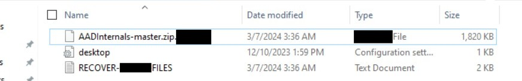
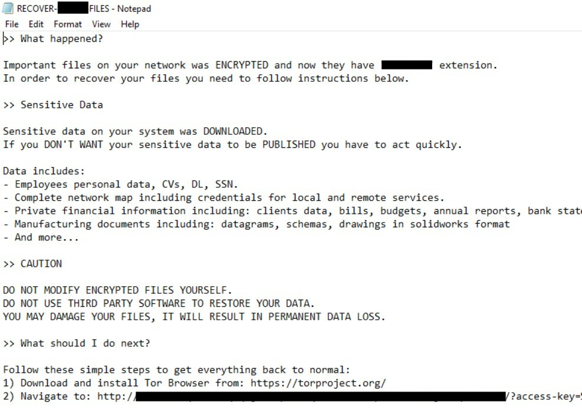

# Xintra's Waifu University Lab Walkthrough (Part 2a)

Writing up a lab walkthrough to figuring out the incident at XINTRA's Waifu University.   This lab is an emulation of Alphv/BlackCat ransomware group. 

### Section 2a. Scoping the Incident
After gaining an understanding about the layout of Waifu's network, the next goal was to kickstart the VM and solve the lab. After an initial read-through of the CTI reports this was built on, and the devices' purposes from above, the first device's triage to inspect was CC-DC-01's. Amongst the devices traversed through so far, it had the highest likelihood of valuable data to encrypt. 

As there's a good chance various Waifu university individuals would need to access resources from CC-DC-01, any ransom note might need to be deployed to a user with a high level of access. Amongst them in the Users Folder of the CC-DC-01 triage, there's a potential file of the ransom note seen in its downloads. 

Upon opening and reading the ransom note, there's more details about the encryption type and domain the victim has to visit for further communications with the group. 

And that concludes the first portion of the lab, Scoping the Incident. 
