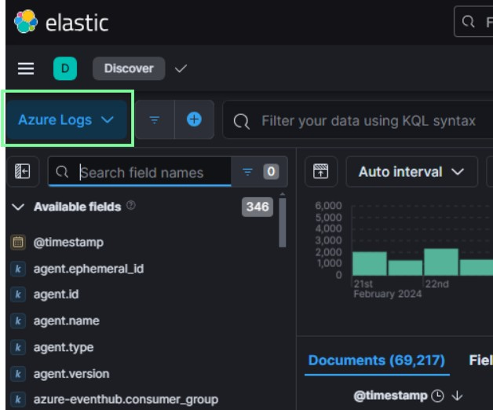
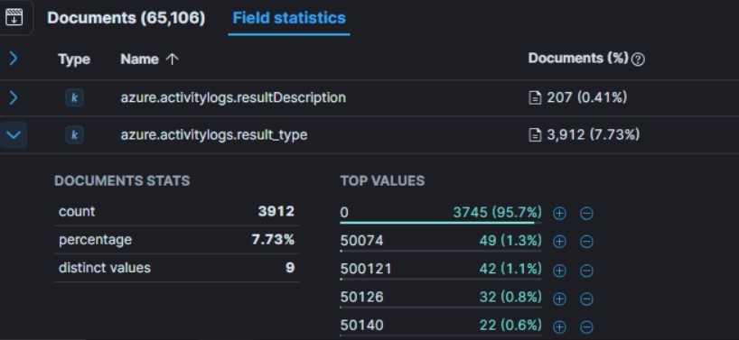
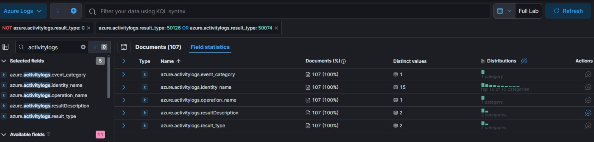
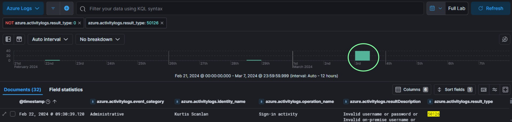
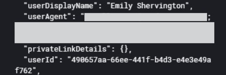
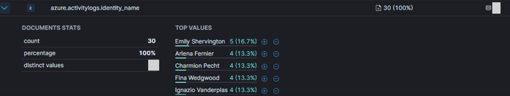
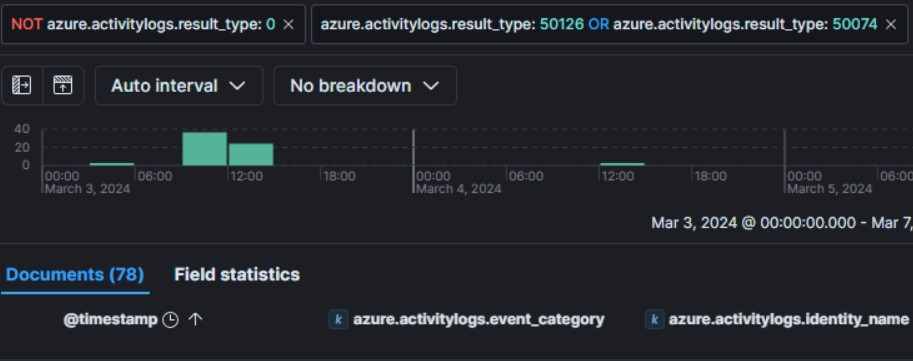

# Xintra's Waifu University Lab Walkthrough (Part 2b)

Writing up a lab walkthrough to figuring out the incident at XINTRA's Waifu University.   This lab is an emulation of Alphv/BlackCat ransomware group. 

#### Section 2b. Initial Access via Entra ID
Now, it's been understood that in order for a ransomware group to come this far; into CC-DC-01 to encrypt files and drop a ransomnote, then some user account with this much access had been used. To inspect what possible Waifu domain accounts were utilised, the next step is to investigate all the logs captured before the triage acquisition date. This will involve looking into the ELK instance, and the respective logs. 

With respect to the diagram, we'd first need to see which Entra ID account was used. Based on the Elastic website, it is shown that Entra ID logs are part of [Azure logs integration](https://www.elastic.co/guide/en/integrations/current/azure-adlogs.html). Therefore, the first thing to do is to ensure our ELK instance is set to inspecting the Azure logs as shown below. 

Once this is done, we can proceed with the details we need to find for how Initial Access was executed. Amongst the logs, there are distinct groups of logs: auditlogs, activitylogs, signinlogs, amongst others. The first hint from the question is that there were failed logon attempts to the Identity Provider (Entra ID). This might mean, while the identity credentials were correct, MFA might've kept blocking the attacker from entering. To narrow down the log type to use for this, we can start with the azure.activitylogs.{subsection logs}. 

To start, some of the subsections included were identity_name, operation_name, resultDescription, result_type and event_category. 

After that, it was useful to OSINT what kind of error values or codes that can come from an unsuccessful logon attempt in EntraID. This [website](https://learn.microsoft.com/en-us/entra/identity-platform/reference-error-codes#aadsts-error-codes:~:text=a%20temporary%20condition.-,AADSTS%20error%20codes,-Expand%20table), gave some values. After inspecting in the ELK instance, the logs that matched these possible errors was the "azure.activitylogs.result_type" field. 

After removing out the "0"-valued logs, the rest of the values for that log, began with "5". Amongst the remaining values, the very intriguing ones included:

i. 50074 - UserStrongAuthClientAuthNRequiredInterrupt - Strong authentication is required and the user did not pass the MFA challenge.  

ii. 50126 - InvalidUserNameOrPassword - Error validating credentials due to invalid username or password. The user didn't enter the right credentials. Expect to see some number of these errors in your logs due to users making mistakes.

These two codes looked promising as a start, and with these has a clue, the first filter was designed to narrow down the logs to the suspicious failed logon activities. 

Thankfully, logs have been significantly reduced. Within the fields, I opted to narrow my values down even further, by removing some names extra names that were out of context of the attack. At this point, it was good to revisit the descriptions of the two error codes from above.   

A failed logon meant that the entered username:password pairs were invalid in the first place. The attacker hadn't gone past that part to require authentication of the MFA challenge. 

Therefore, from that original filter designed above, the focus turned to only azure.activitylogs.result_type = 50126.

Mapped with the timeline, the biggest flurry of failed logons happened in Mar 3rd. Resetting the calendar icon to Mar 3, 2024, 0000 Hours, we have 30 "50126" logs to decipher what we need to know about the Initial Access. 

Opening one of these logs fully: we can acquire the user agent string from its "azure.activitylogs.properties" JSON.  

With this modified timeframe, under field statistics, it is also possible to get the total number of unique users that were used for the attempted logons.  

So, from here, it felt like a good idea to now modify the "azure.activitylogs.result_type = 50126" filter to also be OR 50074. After the failed logons, the ransom note present shows that there was one successful logon, else, it wouldn't have been planted there.   

From there, we might need to inspect the logs whereby after a long series of 50126 logs, a 50074 one lands. 

When seen graphically, there's a lot of activity before noon on Mar 3rd. So scrolling through the logs of that 11th hour, a 50074 log happens at 11:58am of that day, after a lot of 50126 logs. Amongst these 50126 logs, we can see the IP range of addresses were quite close. 

But when inspecting the 50074 log, the IP address is not in the proxy IP range anymore. (Did the attack stop using a Proxy Server?) 

From there, we can extract the identity, email and IP address that successful login came from. And from that IP address, it's possible to find its SSH fingerprint on Shodan. 

And that will conclude the second portion of the lab: Initial Access. 
