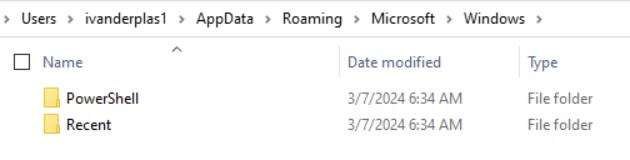

# Xintra's Waifu University Lab Walkthrough (Part 2c)

Writing up a walkthrough to figuring out the incident at XINTRA's Waifu University.   This lab is an emulation of Alphv/BlackCat ransomware group.

#### Section 2c. Breaching the University. 

From here: we've understood the user account used to enter the Waifu university network (ivanderplas1@waifu.phd), and the successful login happened at 11:58am of Mar 3rd 2024. Hence, using this identity, it's likely the actor would've continued into the network. CC-VDG-01, into the Jumpbox, and into CC-DC-01 afterwards. 

Given that VDG emulates what happens at CC-VPN-01, the next best thing is to see if any "entry" happened there next. 

As per our network diagram above, the IP address of VDG is 10.0.0.12. 
With the previous time of incident narrowed down, to 11:58am, Mar 3rd 2024, entry into the Jumpbox would've had to take place after that. 

As we're dealing with the network logs now, and the network photo indicates that the Jumpbox is a Windows machine, the logs to look at now, is the Windows Event Logs.

When filtering the logs to just "winlog.event_data.IpAddress" being of value 10.0.0.12, the logs get narrowed down sufficiently, we can see activity associated to the jumpbox begins at 1:37pm of Mar 3rd, 2024. Some columns added in ELK's view were winlog.computer_name, winlog.event_data.IpAddress, winlog.event_data.TargetUserName. 

Most of the logs registered from that point in time onwards, overlap amongst these 3 values (cc-jmp-01, 10.0.0.12, ivanderplas1). Inspecting the first log from 1:37:32pm, Mar 3rd, 2024, there are some other fields that can be suitable for this section. 

Amongst the fields, the winlog.event_data.WorkstationName is a plausible value for the threat actor's device. 

So, chances are, at the Jumpbox, there would've been some activity. To have a look-see at what might've happened there, the next thing to do is to have a look at CC-JMP-01's triage. As its a Windows Machine, to see if there were any sites the threat actor visited as the user ivanderplas1, it made sense to look into the "C:/Users/ivanderplas1" branch. 

For browser history, looking into "AppData/Local/Microsoft" gives these folders to investigate:

Amongst these, Edge was the most populated folder, and subsequently, a History folder was also found. Opening the history file with the "DB Browser for SQLite" tool, and amongst the SQL tables, the "urls" and "visited_links" tables showed what the threat actor had been looking up. 

At the same time, along with XINTRA's questions, it's also made known that the attacker had done some work with PowerShell. The related data to Powershell is typically part of "AppData/Roaming/Microsoft/Windows"

Opening the PowerShell file, we can extract out the respective domain and subdomains visited by the threat actor. 

And that concludes the third portion of the lab: Breaching the University.

