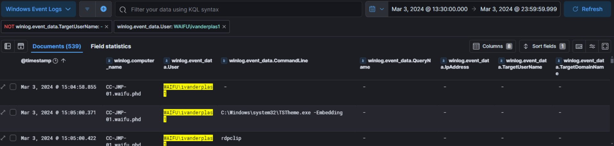
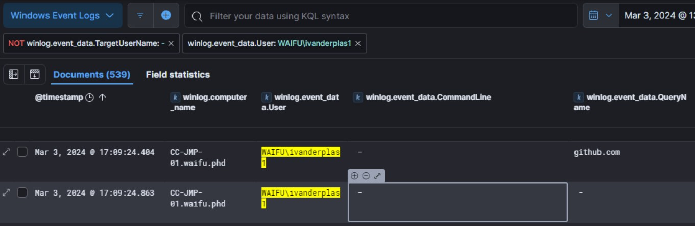
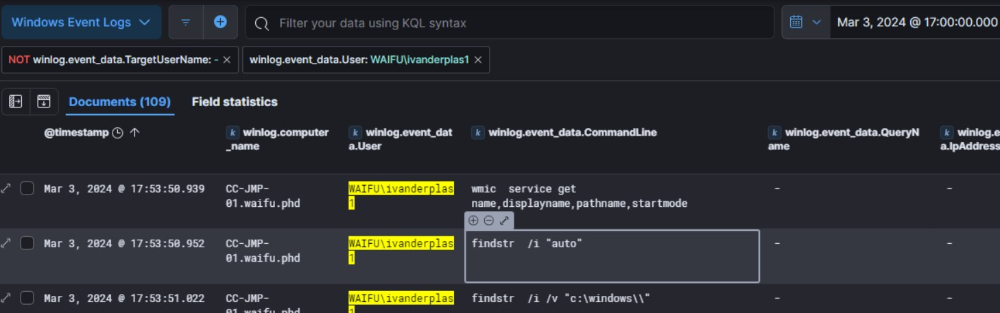
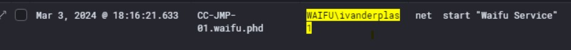
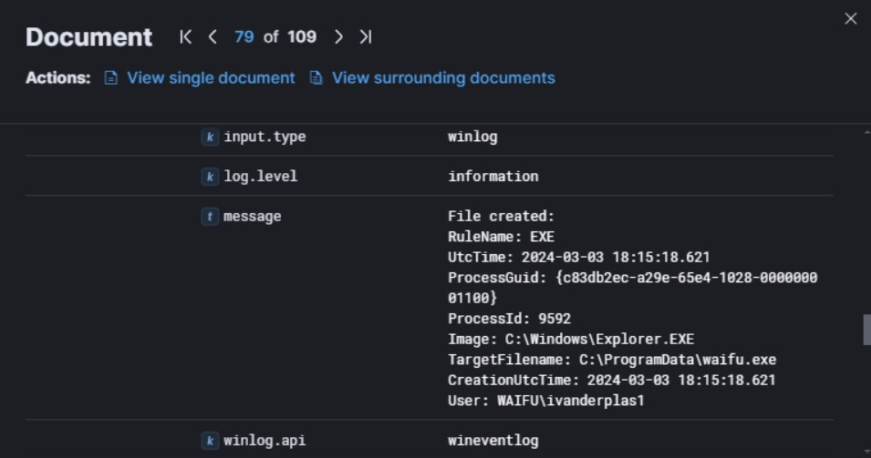
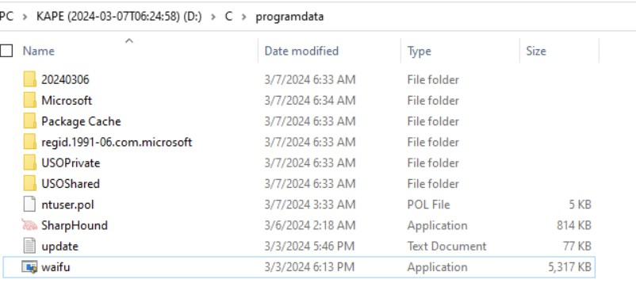
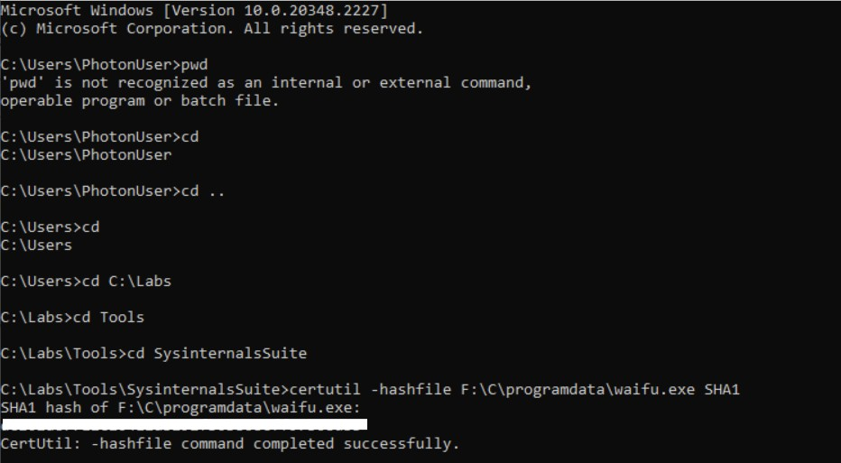

# Xintra's Waifu University Lab Walkthrough (Part 2d)

Writing up a walkthrough to figuring out the incident at XINTRA's Waifu University.   This lab is an emulation of Alphv/BlackCat ransomware group.

#### Section 2d. Privilege Escalation
Moving forward, it took some time to gather all the details we have so far. 
We've narrowed down the user as being "ivanderplas1". In order to ensure those logs of that username is added, one extra column included was "winlog.event_data.User" in the ELK stack for Windows Log events. 

Next, the previous part has shown us that the command line was used in the triage of CC-JMP-01. That value, would've been registered under "winlog.event_data.CommandLine". 

For good measure, those two columns are added into the table, to navigate this privilege escalation better. 

Now with these filtered activity, the next was to see when our github activity on the command line was executed. And we can find that, thereabouts at 1709 Hours on March 3rd. 

Cutting these logs off at this point in time, we can now look at a narrower set to see what else is done. 

After this point, at around 1753 Hours, some interesting commands can be seen. 

The entire compilation of these commands put together is:

    wmic service get name,displayname,pathname,startmode
    findstr /i "auto"
    findstr /i /v "c:\windows\\"
    findstr /i /v """

When Google Dorking this command, it is understood it's a technique called [Find Services with Unquoted paths](https://github.com/xapax/security/blob/master/docs/attacking_active_directory_domain/attacking_windows_domain_local_privilege_escalation.md#manually-2). 
Search this technique with a "mitre" at the back, its TTP code is [known](https://attack.mitre.org/techniques/T1574/009/). 

Continuing the look through the logs, there is a command line input in the next hour, along the lines of 'net stat "Waifu Service"'. What this tells us, this is trying to kick start a network service. Therefore, prior to that, an executable for this was created prior. 

And that particular binary, is found in 2 logs prior to this one:

Its path is also known. Taking its path shown: C:/ProgramData/waifu.exe , the next thing to do is to calculate its SHA1 value. Navigating to this directory this is stored in, it's confirmed available as shown. 

To get its hash value, opted to utilise the tools folder that was made available in the lab environment. One route to get its value is this:

And that concludes this section of the lab: Privilege Escalation. 

