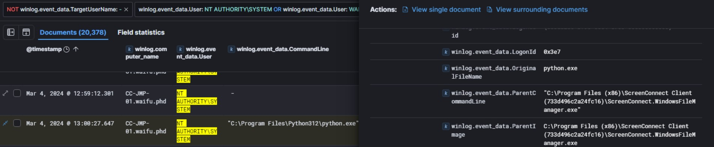

# Xintra's Waifu University Lab Walkthrough

Writing up a walkthrough to figuring out the incident at XINTRA's Waifu University.   This lab is an emulation of Alphv/BlackCat ransomware group.

#### Section 2e. Remote Access

Taking note of the "Waifu Service" net stat log, this happened at 18:16:21 of March 3rd, as "WAIFU/ivanderplas1". The next event would have had to happen after this point. Therefore, after cutting the timeline of logs from 18:15 onwards, there's a narrower set of logs to work with. 

In addition, the threat actor has escalated himself from ivanderplas1 to NT AUTHORITY/SYSTEM, as per the lab's questions. Therefore, it's after that Waifu Service log, we should try and see what services got executed as NT AUTHORITY/SYSTEM. 

Once that service/tool was found, the next thing to find was domain this tool communicated with. One neat trick I used was that, in the KQL syntax, the use of the "*", as a wildcard for part of the string. 

By entering a * at the end and beginning of the tool name, it's possible to see the instances involved around this tool.

And there is one possible solution here:

Afterwards, one interesting log is then indicated, at about Mar 4th, 2024, 1300 Hours. 

Although the command line shows a python.exe file, in its fields, we can see the tool, ScreenConnect. This shows that it's the remote tool getting renamed into something legitimate, like the executable of the programming language. Now that we know it's getting disguised as "python.exe", we should now look for other logs that contain "python.exe" in its CommandLine field, and see which values are different at which time. 

Once again, after executing the wildcard trick on "python", we can see the narrowed logs surrounding this dynamic. 

Looking at the hash values, and toggling across these 6 python logs, by the time it was the 3rd log, at Mar 5th, 23:25:24, its MD5 value was then beginning with "7059...." . 

There is one final item to find in this lab, and it is spoken about in this portion. When a remote tool is set up in the victim machine, it means its goal to make it communicate with another machine elsewhere is in the works. Typically, the indication of that happening, is in network logs. And it happens, that in the XINTRA lab, that can't be found. 

So, an alternative has been provided: a dump file of the malicious process, and with that, figure out the best way to figure out where/who the infected device is meant to communicate with. 

Amongst the tools issued (and some hints with OSINTing), the most feasible one to use was the Cobalt Strike Config Extractor and Parser. 

And that gave the result of the IP result the infected device was meant to talk to, and its respective domain. 

And with that, this section of the lab, Remote Access is completed. 

