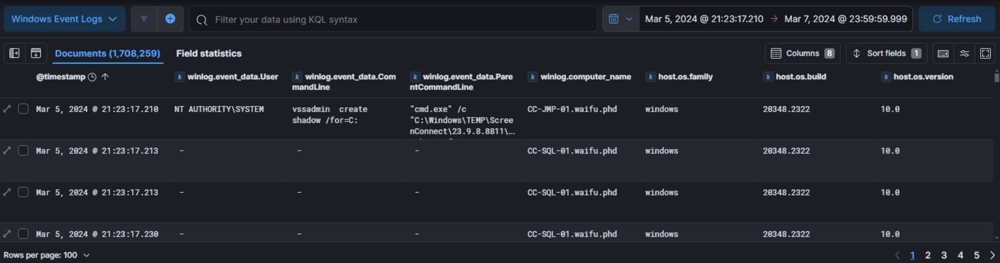
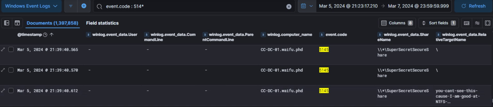
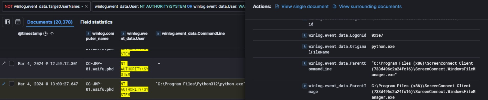
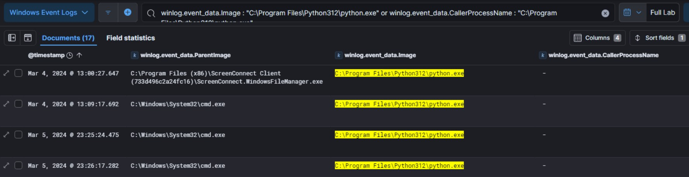
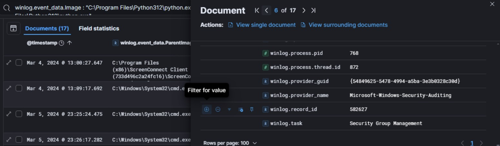
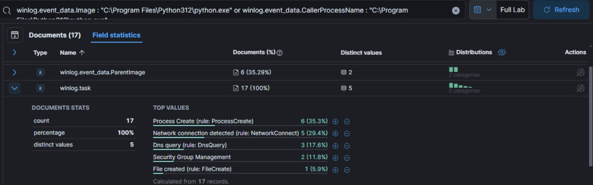
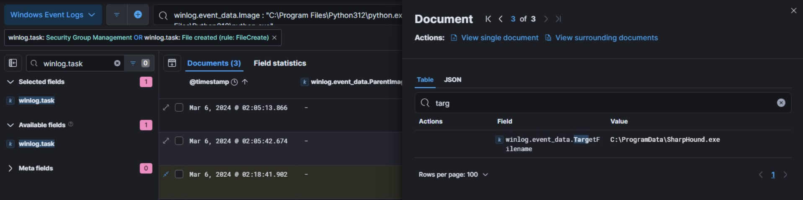
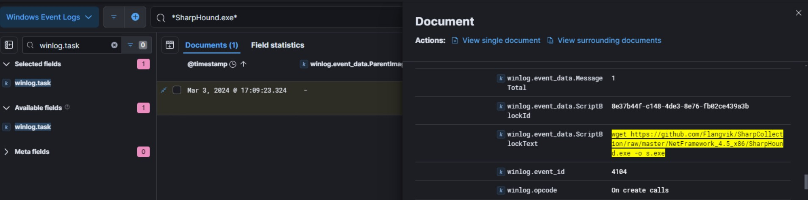
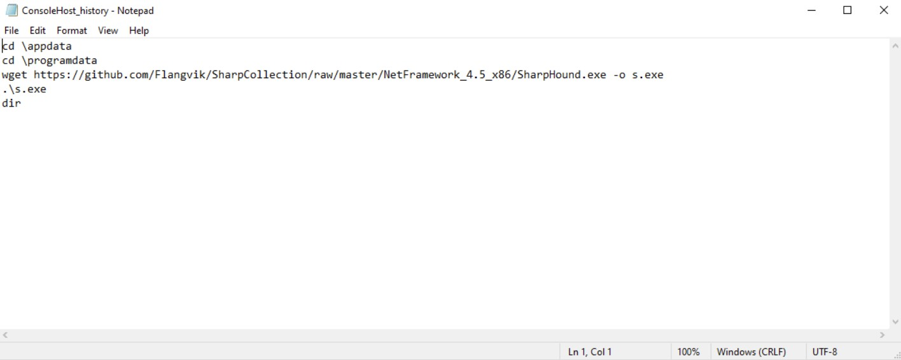

# Xintra's Waifu University Lab Walkthrough (Part 2g)

Writing up a walkthrough to figuring out the incident at XINTRA's Waifu University.   This lab is an emulation of Alphv/BlackCat ransomware group.

#### Section 2g. Looking Around the Network
With reference to the lab, the next activity the threat actor did was open a file that was supposed to be in a hidden share from the beachhead host. There's a brief explainer of what a hidden share is [here](https://superuser.com/questions/309361/what-are-windows-hidden-shares-good-for). After a lot of OSINTing, there's a possible event code associated to this hidden network share [here](https://www.ultimatewindowssecurity.com/securitylog/encyclopedia/default.aspx). And its codes typically begin with "514", provided the OS version is Windows 10+ . 

A suggested way to narrow out the lab logs included adding the following columns below, and the starting point being the point in time the Volume Shadow copy was created. 

However, there were a lot of logs with "514*", and so, one other supporting column that is handy to include is "winlog.event_data.ShareName". A brief explainer of that can be found [here](https://docs.aws.amazon.com/fsx/latest/WindowsGuide/file-access-auditing.html). Amongst the values seen in ShareName, one interesting one was "SuperSecretSecureShare". And for a few of them, when the event.code is 5145 (meaning a network share object was checked to see whether client can be granted desired access), and any files associated with it (with the RelativeTargetName column). 

Now, we can proceed to the next part of this lab section. It requires us to find a tool the threat actor made with the beacon file discovered from Section 2e. We found out that the tool, ScreenConnect, was disguised as a "python.exe" file. 

Here's its image again from above: 

Therefore, any activity around this beacon would mean that this particular file should have been called. So, a suitable column to use for this is something that will represent this python.exe 's filepath (C:\Program Files\Python312\python.exe) as the "origin". For this, the "Image" and "CallerProcessName" fields were used. 

After scrolling through each log's fields enlarged on the side, one extra field came in handy to investigate: the winlog.task field. 

Across the logs that have our pseudo python.exe as the parent process or image, various activity has happened, as shown in the winlog.task field statistics. 

The ones into focus here will be the 'Security Group Management' ones and 'File Created'. 

In the case of the Security Group Management logs, they've been interested in the Administrator accounts, of the "Builtin" domain. 

As for the File Created log, it's called the SharpHound.exe; this was the same tool from Github that was downloaded onto the beachhead host (CC-JMP-01) in part 2c (breaching the university). 

To try and see if more things were done with this file, choosing to filter with the handy wildcard command. 
If any successful execution of SharpHound.exe had happened, a log would've been created with this as a parent process or image. 

Instead, what we see below is this: 

which is the same that we see from the beachhead host's triage's console history:

So essentially, what this shares is that, from the breached host (CC-JMP-01), the original SharpHound.exe 's github repository was reached, and it was renamed as "s.exe", due to the output flag, "-o" . And it had been executed. After which, the "dir" command would've shown the threat actor all the possible directions he could go in the Waifu network. 

However, this latest file creation log with the SharpHound.exe as a name, no new processes have begun from it. This shows that while the file was made (perhaps with a different purpose than the original SharpHound), it wasn't executed.

And that concludes this portion of the lab: Looking Around the Network
