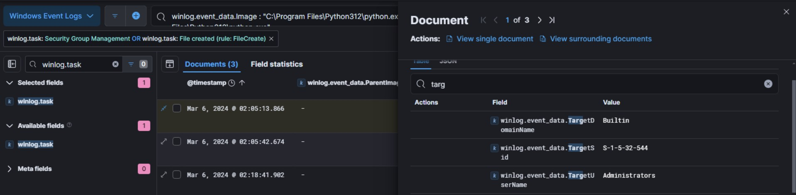
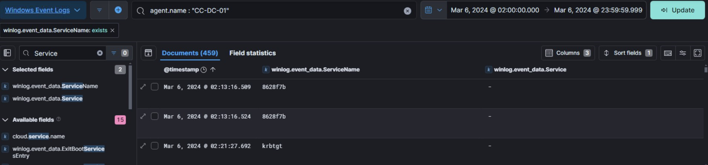
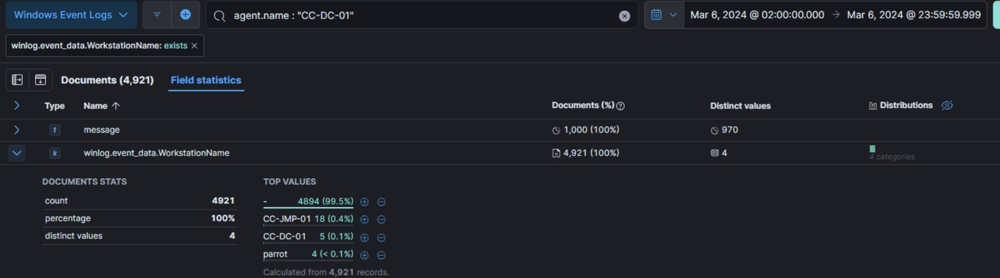
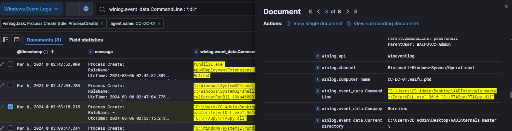
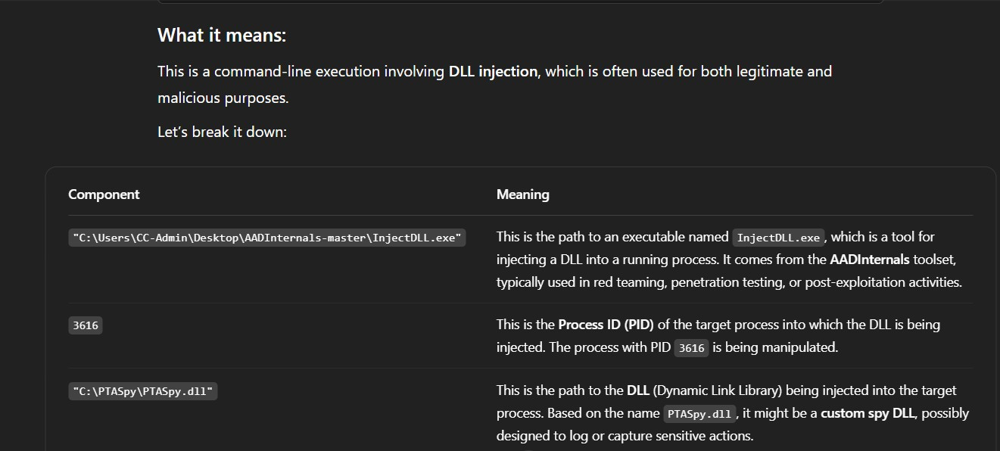
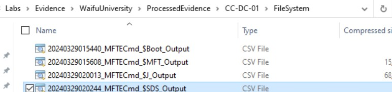
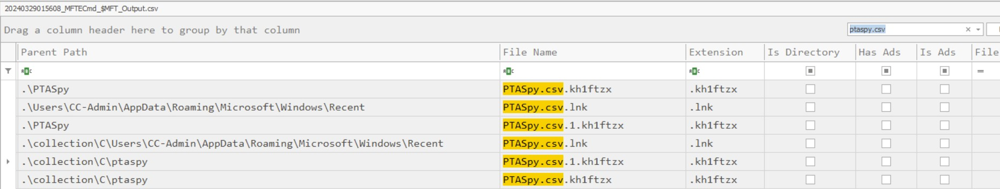
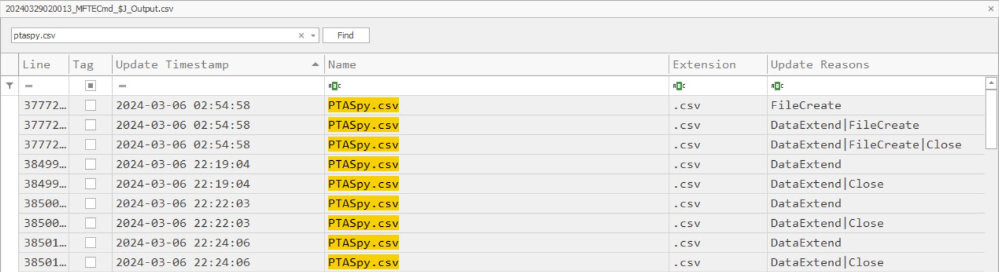
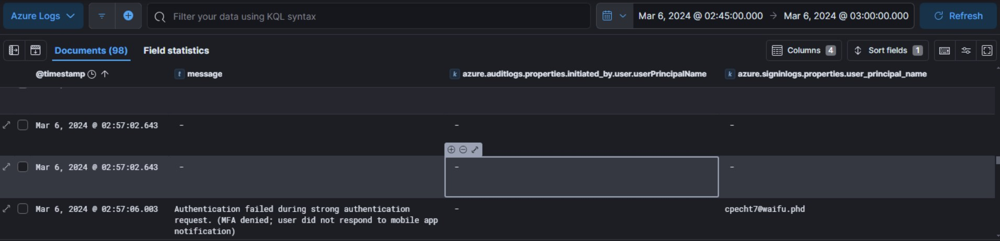

# Xintra's Waifu University Lab Walkthrough (Part 2h)

Writing up a walkthrough to figuring out the incident at XINTRA's Waifu University.   This lab is an emulation of Alphv/BlackCat ransomware group.

#### Section 2h. Domain Dominance
As of now, it's understood that an Administrators group was enumerated through on CC-JMP-01, at about March 6th, 02:05:13. 

Looking back at the Waifu Network image: from the Jumpbox server, the more appealing place the threat actor will hop over to is CC-DC-01. This was also the device where the ransomnote was found, and discovered some files were locked with the ".kh1ftzx" extension. 

Hence, some malicious service would've had to be installed here, and to look for that, one column I opted for was winlog.event_data.ServiceName, and as a ELK filter, ensuring it exists. 

From this, the first service installed into CC-DC-01 is 8628f7b, at 02:13:16, March 6th. 

After that, the next thing to check was the OS distribution system the threat actor would've been using. For that, the next log to check was the "WorkStationName" field, at around the timeframe of the 8628f7b log. 

And amongst the existing values, the "parrot" field is an interesting one. A mini explanation of it is found [here](https://g.co/kgs/wVNZGsn). 

Following this, it's mentioned in the lab that the threat actor then injected a DLL into one of CC-DC-01's processes. And that can be spotted with help from the following columns, like so: 

The Commandline for this log

    "C:\Users\CC-Admin\Desktop\AADInternals-master\InjectDLL.exe" 3616 "C:\PTASpy\PTASpy.dll"

is an interesting one. With a little help from ChatGPT, this breakdown helped in understanding what to look for next eventually. 

The breakdown, courtsey of ChatGPT: 

Therefore, what this shows is that Process ID 3616 in CC-DC-01 had the malicious PTASpy.dll installed within it with help from the builtin Windows toolkit. Therefore, after clearing out the filters in place so far, and adding all the fields about process IDs as columns, the next thing to do was to filter for Process 3616 in all plausible forms. 

winlog.event_data.ProcessID : 3616 (in Base 10 form)
winlog.event_data.processId : 3616 (in Base 10 form)
winlog.event_data.ProcessId : 0xe20 (in Hexa form)

Process name to ID, based on the logs so far, it's referring to processes associated with AzureADConnectAuthenticationAgentService.exe . 
With regard to finding out the credentials that were spied on and collected by PTASpy.dll, the first thing to do was to find any artifacts this "spying" might've created. For that, inspecting the processed evidence of the domain controller was the suitable technique

Amongst the files, the ones that proved to be useful were $MFT_Output and $J_Output. In the MFT_Output file, after looking up "ptaspy", it became clear this tool then created a .csv file as well. And then, specifically, narrowing that csv file down, it showed where this is located. 

However, when traversing to the path shown, to get to the .lnk file, the CSV file is not existing in the processed evidence folders. Therefore, the next best thing to do was to try and carve it. When looking up ways to do so, the LECmd tool by Zimmerman could be tried out (and it is a tool that's installed in XINTRA's workstation). 

After changing directory to where the tool exists, and executing the command, like so as advised from [Zimmerman's Github](https://github.com/EricZimmerman/LECmd):

    C:\Labs\Tools\EricZimmerman\LECmd>LECmd.exe -f "D:\C\Users\CC-Admin\AppData\Roaming\Microsoft\Windows\Recent\PTASpy.csv.lnk"

 we can see it helped carve out the CSV we want in question, and it had a file creation date at March 6th, 02:54:58. In addition, it's further confirmed by the $J_Output results. 

Hence, given the "birthday" of this PTASpy.csv, the next thing to do is to try and hunt for a Azure Log of that same timeframe, or even timestamp if it can be that accurate. So by choosing Azure Logs on the top left corner, and a timeframe of 15 mins from 02:45:00 to 03:00:00 on March 6th, we can see a potential result of another Waifu identity that was spied on by PTASpy.dll, and possibly captured into the csv file. 

And that concludes the domain dominance of this lab. 
