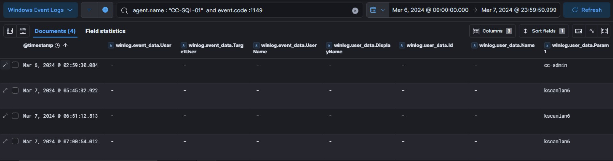
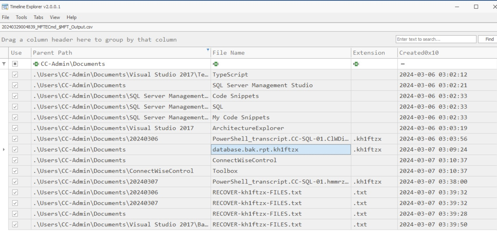
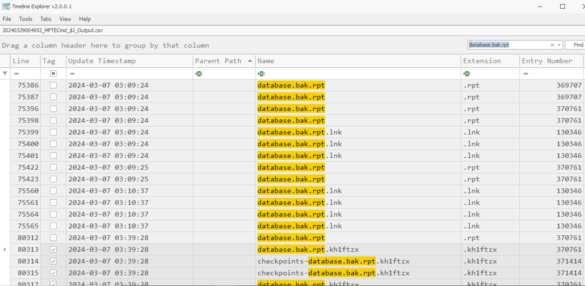

# Xintra's Waifu University Lab Walkthrough (Part 2i)

Writing up a walkthrough to figuring out the incident at XINTRA's Waifu University.   This lab is an emulation of Alphv/BlackCat ransomware group.

#### Section 2i. Accessing the Good stuff
We've come awfully close to the end of the lab. Now, with initial access done, lateral movement done, and extra credentials spied and collected, we can safely say the threat actor now has a good amount of access into the Waifu network. 
Likely now, the main goal they could have is to infiltrate the last device in the network, possibly CC-SQL-01 and place ransomware files all across the devices at this point. 

At this point, access into CC-SQL-01, might've used some remote connection protocol. As it's a Windows Machine, RDP might be one, and the lab gives us a hint of the same. Luckily, Sysmon's event.code log has a value for an established RDP connection. The value for that is 1149, as shared [here](https://frsecure.com/blog/rdp-connection-event-logs/). 

Given the previous activity of the PTASpy.dll's CSV file, amongst the RDP connections established, this one by the cc-admin account in the SQL server would make most sense. 

After that, the information we have from the lab is that the Waifu University admins noticed a strange file in the documents folder of the admin user for the SQL server which was created during the intrusion. For this, toggling into the $MFT_Output.csv file from CC-SQL-01. 

Looking into the logs, there is some resemblence of our earlier parts of the lab. We're seeing the ransomware entering children directories here, and dropping ransom notes, as discovered from the first part of the lab. 

And amongst them, we can see the odd file the admins might've seen: the database.bak.rpt.kh1ftzx . To take note, the last extension of this file, is .kh1ftzx. That's the extension the ransomware has on any affected file. Which means, the original file, is database.bak.rpt , and it might've been an asset the threat actor wanted to lock.

To see when this particular file (database.bak.rpt) might've appeared again, the next CSV to investigate is the $J_Output csv for CC-SQL-01. 

That's how we can see the timeline of modifications this database.bak.rpt file has gone through, up to and including the time at which it starts getting locked with the malware's new extension. 

That concludes this portion of the lab, accessing the good stuff. Onwards to the final part: release of the ransomware. 
