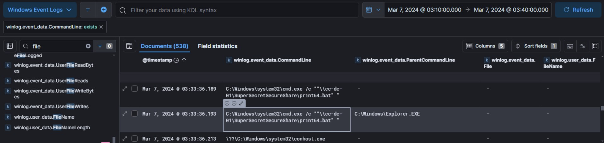
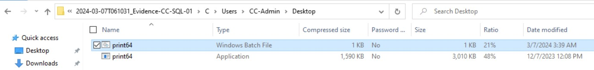

# Xintra's Waifu University Lab Walkthrough (Part 2j)

Writing up a walkthrough to figuring out the incident at XINTRA's Waifu University.   This lab is an emulation of Alphv/BlackCat ransomware group.

#### Section 2j. Release of the Ransomware
So far, we've noticed ransomware notes being present in CC-DC-01 (from scoping the incident), and in CC-SQL-01 (with the .txt file appearing here and there in some directories). But to narrow down what happens, and how this ransomware binary behaves: let's solve this with what we've narrowed down in CC-SQL-01's Journal file ($J_Output)

Revisiting the previous image:  

We can see there's a rough time, between Mar 7th 2024, 03:10:37 to 03:39:28 where the changes in file extensions are visible. This can possibly mean that the ransomware must've been executed within this half hour or so. 

With these parameters, and the CommandLine columns, let's narrow down when this ransomware file might've been executed. 

There's a flurry of activity until this log at 03:33:36, Mar 7th 2024:

This .bat file, is also visible in CC-SQL-01's Users/CC-Admin folder. 

A rough explanation from ChatGPT shows that this executable is meant to run with this token value. 

And that concludes the Waifu University Lab ~~ 🥂🎊⚡