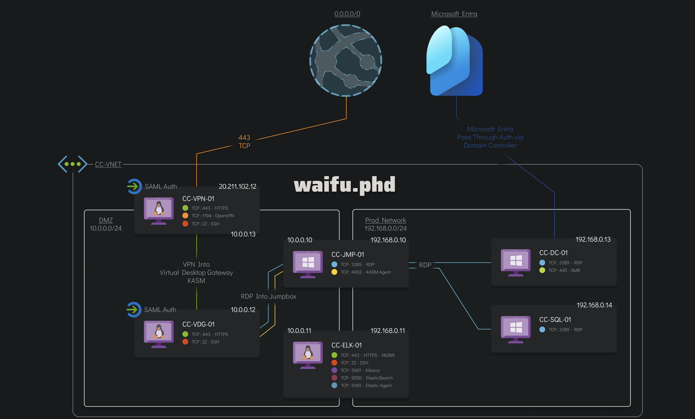

# Xintra's Waifu University Lab Walkthrough

Writing up a walkthrough to figuring out the incident at XINTRA's Waifu University.   This lab is an emulation of Alphv/BlackCat ransomware group.

### Section 1: Understanding the network
From a bird's eye view, the network at Waifu follows a standardised design. Anyone, from the university who has access to the domain, should be able to connect to the production network, once authenticated in the DMZ part of the network. 

Let's take it step-by-step, assuming one's trying to connect into the production network.

#### 1a. Internet to DMZ
First, anyone from the internet has to enter the network first. The DMZ is a buffer between the CC-VNET and the internet.  

External users first attempt to connect to CC-VPN-01 (20.211.102.12) via the protocols shown (HTTPS, OpenVPN, SSH). CC-VPN-01 is configured to use SAML authentication, meaning it may not store passwords locally. Instead, it will redirect the user to an external Identity Provider (like MS Entra, used here). The user will then enter their password and MFA, and when verified, a SAML Assertion token is sent back to CC-VPN-01 confirming the user's identity. 

After the credentials are validated, the user establishes a VPN session into the DMZ (10.0.0.0/24). 

#### 1b. DMZ to Production Network
The other component in the DMZ is the Virtual Desktop Gateway (CC-VDG-01). The VDG assumes that a trusted VPN session is spun up with verified the user's MS Entra identity, and they can log in to a remote desktop environment.  But not all users will have the same access to the Waifu domain's resources. At VDG, the user's Waifu domain credentials get verified to provide the right amount of access. 

For that, Active Directory authentication is used. It's to make sure that a user has the correct set of permissions to access resources they may need from the internal systems based on Waifu's policies and role-based access controls. 

From CC-VDG-01, users connect via RDP to the Jumpbox, CC-JMP-01. The Jumpbox acts as a gateway to the production network. Only RDP is used between the Jumpbox and the production network's servers.  Here's one explainer video [why that's the case](https://www.youtube.com/watch?v=9FN31QDLyFs).  

CC-VDG-01 forwards authentication request to the Domain Controller (CC-DC-01). The DC verifies credentials and applies the respective access to the user. 

CC-ELK-01, is the server where all login attempts, VPN Connections and failed authentications will get logged and monitored. 

